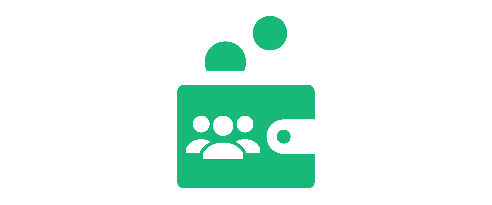

  

## 🍄 Social Account Abstraction Recovery and Management

Experience the future of social account abstraction recovery — where accessibility meets security, and your Ethereum identity is never out of reach.

Application provides GraphQL API and command-line interface for a managing recovery process of your ethereum-based
account-abstraction smart contract in case your keys are compromised, or you cannot get access to keys.

This is proof-of-concept of socio-technical mechanics related to account recovery

## 📋 Feature list

- [x] Social Recovery via your friends' social network accounts
- [ ] Web UI for SRA
- [ ] Mobile UI for the wallet owner
- [ ] Freeze your account via Telegram bot (and unfreeze with private keys which are not compromised or with SRAs)
- [ ] Storing recovery process state onchain (or in decentralized storages like IPFS)
- [ ] Different wallets (accounts) with transaction amount limits

## 🥕 Assumptions and requirements

1. SRA can use different entropy sources for hash generation, for PoC we use hash from Google account ID
2. SRA is not required to use ethereum wallet

## 🧊 User flow description

1. Create Account Abstraction (AA) wallet
    - Deploy AA smart into blockchain
1. Add social recovery agents (SRA) and alerting accounts
    - Ask your friend to generate hash from some data only he knows. In the current example, we use hash from Google
    account data, and salt (owner's account address) via web app and get another hash from this
    hash [add link to web app]
    - Collect you alerting public keys (their private keys owners can freeze you wallet if something)
    - Writes alerting public keys and hash of SRA's hash to AA smart contract
1. (...You lost access to your keys or compromise it...)
1. Freeze your wallet
    - User asks somebody with alert private keys (including themself) to send an alert transaction to user's AA wallet
1. Start a recovering process by asking all social recovery agents for their social data
    - Go to your friends (only you know the list of them)
    - Ask them to generate hash from their social data via web app
    - Collect and store in app all the hashes of your friend (currently - android wallet with recovery feature)
1. User change access wallet
    - User submits transaction to blockchain with SRA's data hashes
    - Smart contract checks the validity of hashes stored and calculated based on user's input
    - Smart contract updates owner if hashes are equal
